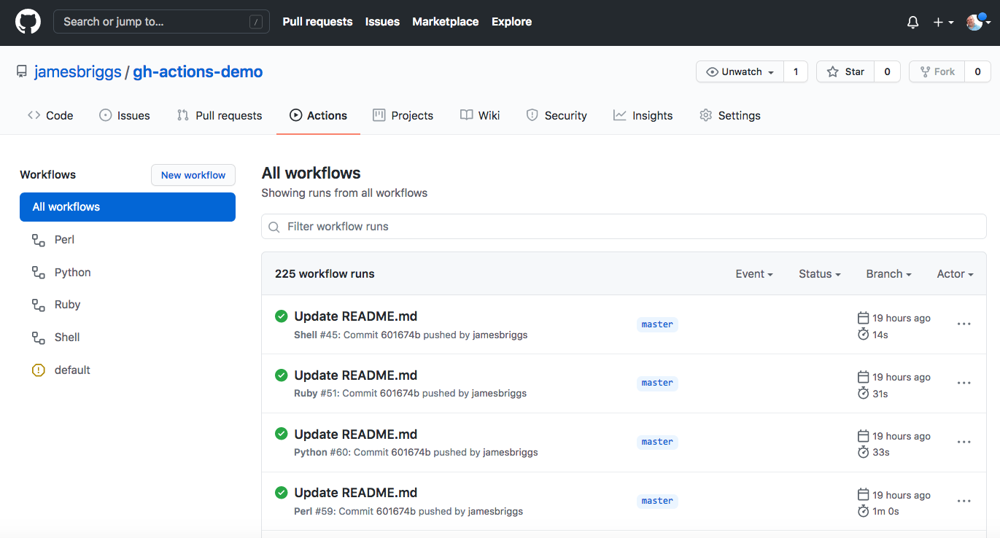

# gh-actions-demo

## Introduction

Github Actions PoC demo repo for several programming languages and associated linters in one repo simultaneously:

1. Bash (Shellcheck)
1. Python (flake)
1. Perl (perl -c, podchecker and prove)
1. Ruby (ruby -wc)

See `.github/workflows/` for the workflow build scripts.

 

 
 
[Screenshot: GitHub Actions showing 4 parallel workflow results]

## How Github Actions Works

Github Actions works by starting Docker containers for each OS or programming language version (aka "matrix-build") you specify using YAML scripts. If you're using Github anyway for source control, and your automation is amenable to Github Actions, then it's a very useful option compared to Jenkins, etc., and reduces administration.

When there's multiple workflow scripts, all are executed in parallel. The workflow script has to decide by directory or file extension what the run actions are. After three build errors, execution automatically stops to conserve resources.

## Workflow Security

Only push events (not pull) are specified in this repo to avoid reported security problems with cloned repos used in unauthorized bitcoin mining via pull requests.

## Limitations

Note that as of July 2021, workflow scripts do not know which specific files were changed in a git commit, so it's up to you to
either process all files new and old, or calculate the change list if necessary. Two different techniques are:

1. https://dev.to/scienta/get-changed-files-in-github-actions-1p36
1. https://github.community/t/is-it-possible-to-run-the-job-only-when-a-specific-file-changes

## PoC Results

The motivation for this PoC was to evaluate basic functionality for a multi-language REST API SDK repo.

The positive results are that:

1. The functionality meets the basic PoC requirements for linting files by language for multiple languages in the same repo.
1. The matrix-style permutation of Docker containers by OS and language version is remarkably powerful and easy to use. The built-in Mac OS and Windows remotes is very handy, and for most people who manage Jenkins and don't want to manage those operating systems, an increase in capability.
1. As a hosted build solution, it eliminates the need to manage Jenkins master and remote instances, for example.
1. The Actions UI is very responsive and clear for programmers with no training needed. Note that writing workflows in YAML has a moderate initial learning curve.

The remaining concerns are:

1. It should be easier to enumerate the file changes list in a commit, but there are workarounds (see above.)
1. Github Actions is Github-specific, so there's lock-in for complex workflow scripts.
1. There are costs/limits for using Github Actions, so either the duration of tests and matrix options need to be limited, or the cost budgeted.
1. Althought Github Actions was released Aug. 8, 2019 and is fairly capable, it is still evolving, so is not a mature feature yet. In contrast, Jenkins has been around since 2004, with the current "Pipeline" feature enabled by default since April 20, 2016.

## Future PoC Tasks

In addition to linting, test the entire SDK in a Docker container, then upload to Docker Hub. (Currently done using Jenkins Pipeline with the Docker plugin.)

